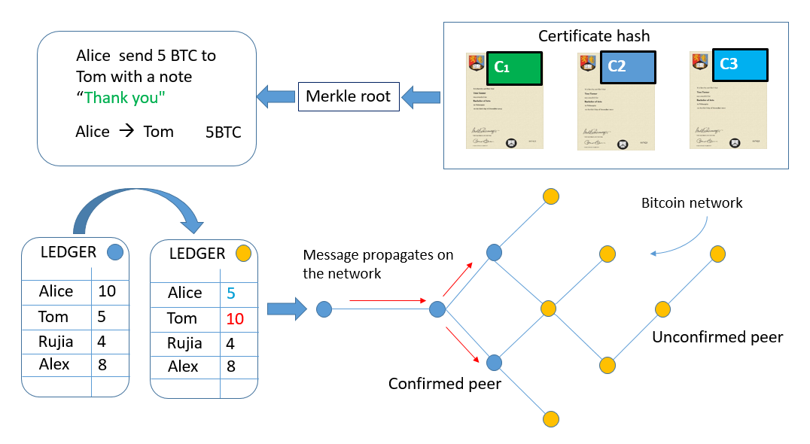
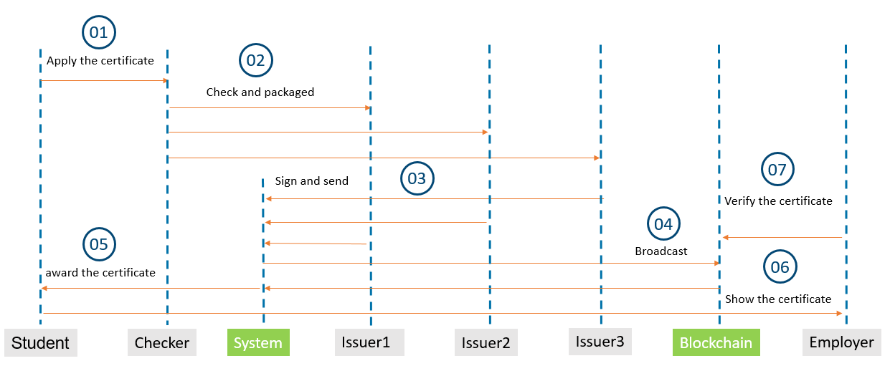
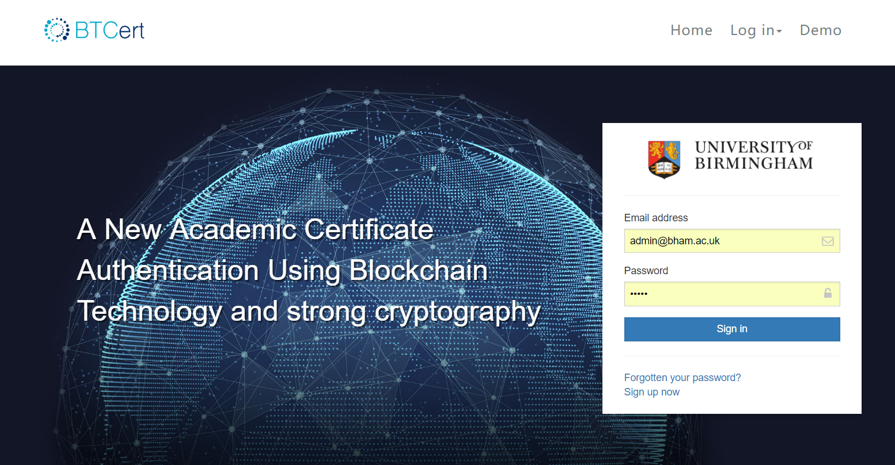
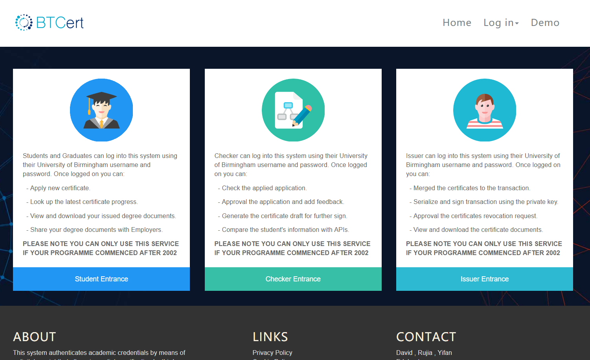

# BTCert

## Content 
```
├── Overview
├── Prototype workflow
├── System architecture
├── System Security Analysis
├── Prject resource 
├── System deployment
└── Futrue work
```

## Overview  
BTCert is a project for Rujia's master degree and sponsored by ITIC University of Birmingham. BTCert is a blockchain based project for protecting authentic qualifications (academic certificate). The project is inspired by Blockcerts and based on its open standard. BTCert employed the same principle with Blockcerts. BTCert releases the credential by sending a Bitcoin transaction from awarding institution to recipient. A good metaphor is illustrated in Figure 1, a set of hash value of certificates would be attached to the Bitcoin transaction when Alice paid 5 BTC to Tom(replace the node node "thank you" by the merkle root). Then, BTCert allows an independent verifier to verify the authenticity of such credential by accessing hash value on the blockchain and comparing it with the local digital file's.


*Figure 1. Working mechanism of Blockcerts*

Also, BTCert employed some new cryptographic technologies to make it more secure.These cryptographical protocols includes using multiple signature approaches to improve certificate authentication, exerting a safe revocation mechanism based on BTC address to revoke a certificate more reliably, and establishing a secure federated identity aimed at verifying certificate awarding institution's identity. 

Lastly, since the core cryptographic parts of BTCert are implemented by utilizing JavaScript, BTCert allows all sensitive data all handled at client side (browser). In another word, BTCert never transferes and stores any sensitive data such as the private keys, which made the server data more secure.

## Prototype workflow
For helping the readers to have a better understand of BTCert, we created a prototype model workflow for four main roles, including student, checker, issuer, system and employer. The prototype workflow is shown in the figure 2 below.

*Figure 2. Workflow of prototype.* 

Specifically, the prototype workflow is as follows: Firstly, the student applies to the school for a certificate, and the certifiers check the students’ information and merge the certificate with a Bitcoin transaction once it is approved. Then the majority of the academic committee members sign it with their private keys. After that, the system broadcasts the transaction which contains the Merkle root for all the certificates. Following the above step, the student receives a JSON-based certificate once the transaction is confirmed by the miners. In the next stage, the student provides the JSON-based certificate to the employer, when he or she applies for a job. Lastly, the company verifies the certificate via access to the Blockchain and checks the authentication code to confirm the indentity of the school.

## System architecture  
As it is shown in Figure 2, the system briefly consists four components in our implementation: verification application including federated identity, issuing application involving multi-signature and BTC-address based revocation, Blockchain and local Database adopted by MongoDB.

The issuing applications are responsible for the main business logic which includes the applying for, examining, signing and issuing of the certificates. The issuing applications are designed to merge the hash of the certificate with a Merkle tree and send the Merkle root to the Blockchain. Also, the issuing applications deal with the revocations of certificates. The main component functions for issuing applications are described as follows:
> +	Login function
> +	Privilege control (RBAC mode)
> +	The approval process (student->>checker->>supervisor->>administration staff->>head of school)
> +	Multi-signature function
> +	Auditing the certificate
> +	View the published certificate
> +	View the signed certificate
> +	View the certificate ready to sign
> +	Revoking the certificate batchly
> +	Administration page to manage the user, the privilege and certificate.
> +	Cold storage for the keys (will release in next version)

The verification application focuses on checking the authenticity and integrity of the certificates that have been issued. It includes two main components: a web-based page and an Android-based application. They use the same mechanism, and fetch the transaction message through the blockchain API and compare the transaction message with the verification data from the receipt. The mechanism can be briefly described in the following way: check the authentication code is valid; check the hash with the local certificate; confirm the hash is in the Merkle tree; ensure the Merkle root is in the blockchain; verify the certificate has not been revoked; validate the expired date of the certificate. Also, it has to be mentioned that for the convenience of sharing the certificates, the Android-based application allows for verification of the documents by scanning the QR code directly. The main component functions for verification application are described as follows:
>+ Upload the PDF files / Scan the QR code
>+ Calculate the hash value for the PDF file 
>+ The interaction with blockchain API 
>+ Authentication management: the issuing address relationship with the school identity.
>+ The logic of the verification:
>> The verification of hash value on the certificate  (to avoid tampering)  
>> The verification to confirm if the hash value is in the merkle tree
>> The verification to confirm if the hash value of the merkle tree root is on the blockchain
>> The verification of the validity of the certificate (to avoid the revoked certificate)
>> The verification of the valid date of the certificate (to avoid the expired certificate)

The blockchain acts as the infrastructure of trust and a distributed database for saving the authentication data. Typically, the authentication data consists of the Merkle root generated using hashed data from thousands of certificates. The MongoDB is employed as our local database since the MongoDB can successfully manage JSON-based certificates and provide high availability and scalability.

*Figure 3. System architecture diagram*

## System Security Analysis
**Network security**  
Currently, it's dangerous to open server for receiving the internet request directly. Most companies buffer their contact with the outside world by employing a DMZ. The DMZ create a security gap between intranet and internet. Ideally, to access internal resources, every request has to go through this DMZ. However, even DMZ has the most stringent rules. there is still the probability that hacker from the outside still can access the internal side. In our project, our core database and issuing service run on the internal network that is an envelope environment, in other words, our deployed environment is physically isolated from the outside. A hacker from the outside has no possibility of accessing the internal side except for physical intrusion. This is much more secure than traditional service running inside a DMZ.

*Figure 4. System architecture diagram*

**Data security**  
The database has been designed to contain two categories of data: the public authentication data and the private certificate data. The public authentication data is available to the public and released to the blockchain; the private certificate data is stored in the MongoDB where it is securely protected and isolated in the intranet.

*Figure 5. top level data flow diagram *

Figure 5 maps out the top level data flow diagram. It shows that the data flow is unidirectional from the internal areas to the internet. The issuing system reads the certificate from the MongoDB and broadcasts its "point" data to the blockchain. The verification service only needs access to the blockchain to check the authenticity of the certificate.


**procedure security**  
The certificate issue and revocation process are very secure. This has been achieved in the
following three ways. First, the ''issue and revoke key'' is distributed among different members of
the academic committee, and the members are not allowed to access these critical operations
individually, what's more, the system records and monitors all the activity related to issuing and
revoking certificates. Lastly, the process of certificate issuing and revoking is democratic,
requiring the majority of the academic committee members to sign.

Leaking the password is a risk in the system, but the system is still secured. A leaked password is
difficult to exploit for hackers, due to the lack of the private key that plays an essential role in
issuing or revoking certificates. What's more, the system is not allowed to store the private key,
and it provides enough protection mechanisms for the saved passwords and credentials. Thus,
leaking of passwords would make the system vulnerable, but it would not provide a fraudster with
any useful information.

Leaking the password as well as private key would be a threat of to our system as it would, from
the functional point of view, it allows the hacker to access to all the operations and resources of
the system. However, in terms of the business logic, we can certainly solve this problem, since
each transaction needs to signed by the majority of the academic committee members.In the most extreme case of all, of the academic committee members leaking the password and the private key at the same time, there is no doubt that the system would be paralyzed. It would be impossible to prevent an attacker from awarding "legal" certificates. In other words, even if the awarding institution revoked the certificate in public at a later date, the independent verifier would have no idea about the difference between a valid and an invalid certificate, except for additional proof from additional authorities about the time when the transaction was performed.


## System deployment  
**Code structure :** 
```
├── README.md
├── pom.xml
├── app.log
└── src
    ├── main
    │   ├── java
    │   │   └──  org.bham.btcert
    │   │   		└── config
    │   │           └── controller
    │   │           └── exception
    │   │           └── filter
    │   │           └── model
    │   │           └── persistence
    │   │           └── service
    │   │           └── utils
    │   │           └── StartApplication.java
    │   └── resources
    │       └── config
    │       └── static
    │       └── templates
    │       └── application.properties
    └── test
        └── java
            └──  org.bham.btcert
```

**Project prerequisites:**  
Operating system: Centos 7 x86_64    
JDK: 1.8  
Docker: Docker CE 17.6  
Maven: Maven 3.3  

**Project deploy instruction:**
1. Install the running environment.  
2. Import the code from repository  
3. Switch to directory  
4. Start the project without Docker  
>Cd /BTCert  
> mvn package && java -jar target/Boot-0.0.1-SNAPSHOT.jar  
> nohup java -jar target/Boot-0.0.1-SNAPSHOT.jar &  
5. Start the project with Docker  
> mvn package docker:build  
> docker images  
> docker run image_name:tag_name  

## System resource 
**Project screenshots:**  





Project home page: http://www.btcert.org/  
Intranet home page: https://btcert.com  
Public verifying page: https://btcert.com/verify       
Intranet login page: https://btcert.com/login  

## Futrue work
As the [telegraph](http://www.telegraph.co.uk/investing/news/bitcoin-transaction-fees-have-become-high/) reported, Bitcoin transaction fees have skyrocketed in recent weeks with a typical transaction now costing up to (£15). The cost of attaching the data to the bitcoin blockchain is increasing significantly. In the future, we may replace the bitcoin blockchain infrastructure by adopted Ethereum or Hyperledger.

